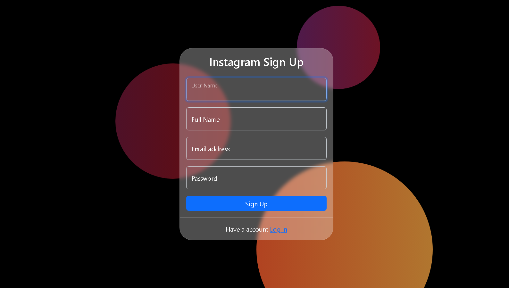
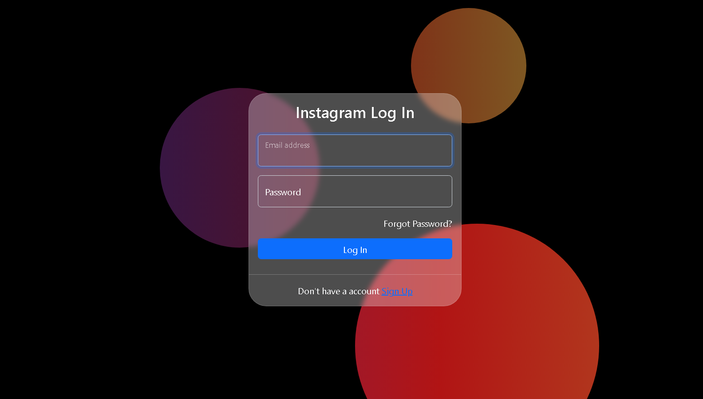
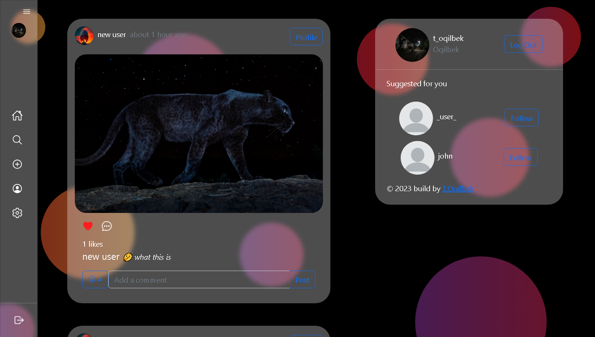
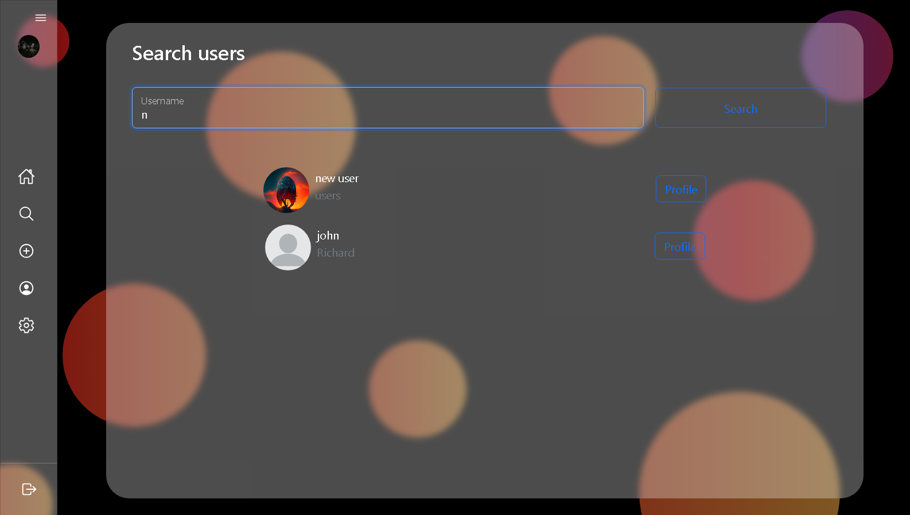
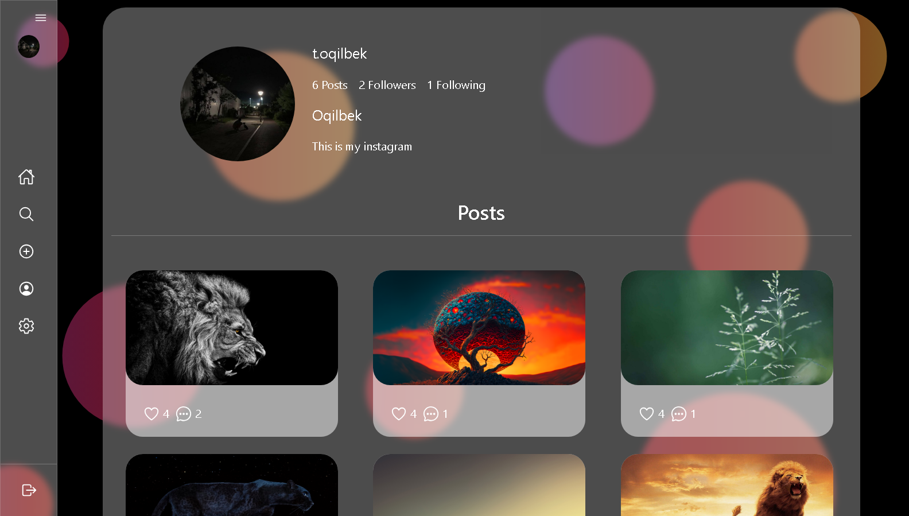

# Welcome to My Instagram
My Instagram App

## Task

[Live Demo](https://my-instagram-tapp.netlify.app)

## Result
- The design of the My Instagram App includes:

    - You can see these are the sign up, log in, main, search and profile pages.
<table>
    <tr>
        <td>
            
        </td>
        <td>
            
        </td>
    </tr>
</table>
<table>
    <tr>
        <td>
            
        </td>
    </tr>
</table>
<table>
    <tr>
        <td>
            
        </td>
        <td>
            
        </td>
    </tr>
</table>

## Installation

```
    npm i or npm install
```

## Usage
TechStack

- HTML, CSS
- Bootstrap5
- chakra-ui/react
- mui/material
- @fortawesome/fontawesome
- firebase
- React

Features

- Sigup and Login
- Change password
- Users exists as you type username when signing up
- Follow, Unfollow and Profile views
- Like, Comment (Sticker and Text), Delete post, Open post
- Time ago format used everywhere
- Edit your profile (From username, Fullname, Email, Password)
- Get suggestions on whome to follow (you can also refresh suggestions)
- Search users
- Create post

### The Core Team

- <a href="https://github.com/Oqilbek2121">To'lqinov Oqilbek</a><br>

### My Dropbox Demo Link

```
    https://my-instagram-tapp.netlify.app
```